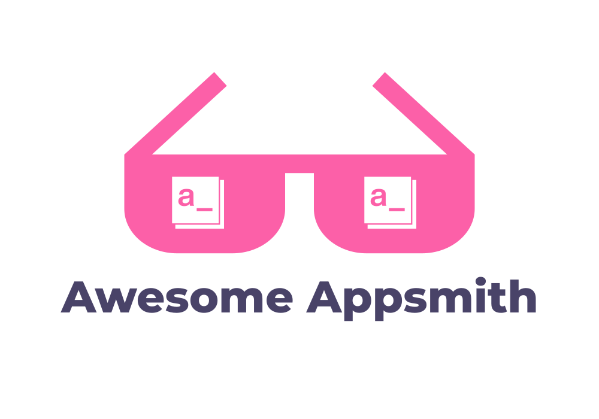

# Awesome Appsmith 

## Table of Contents

- [What is Appsmith?](#what-is-appsmith)
- [Important Appsmith Links](#important-appsmith-links)
- [Appsmith Tutorials](#appsmith-tutorials)
- [Appsmith Events](#appsmith-events)
- [Appsmith Videos](#appsmith-videos)
- [Appsmith Live Demos](#appsmith-live-demos)
- [Appsmith Templates](#appsmith-templates)

## What is Appsmith?

**Appsmith is a low code, open-source framework to build internal applications or tools.**

🏗️ With our JavaScript-based visual development platform, build CRUD apps, Dashboards, Admin Panels, and many more 10x faster.

🎨 You can use our pre-built UI widgets, connect them to your APIs and databases to build dynamic apps and complex workflows.

🚀 And the best part? Deploy these apps on the technology you prefer! (self-host for free!).

 

## Important Appsmith Links

**Appsmith Core**

1. [Appsmith Cloud](https://www.appsmith.com)
2. [GitHub](https://github.com/appsmithorg)
3. [Appsmith Documentation](https://docs.appsmith.com)
4. [Appsmith Roadmap](https://github.com/appsmithorg/appsmith/projects/3)
5. [Appsmith Blog](https://www.appsmith.com/blog)
6. [Appsmith Status](https://status.appsmith.com)

**Appsmith Social and Community**

1. [Discord](https://discord.com/invite/rBTTVJp)
2. [Community / Forum](https://community.appsmith.com/)
3. [YouTube](https://www.youtube.com/appsmith)
4. [Twitter](https://twitter.com/theappsmith)
5. [LinkedIn](https://www.linkedin.com/company/appsmith)

## Appsmith Tutorials

1. [Building a Store Catalogue Management System using Appsmith and GraphQL](https://www.appsmith.com/blog/building-a-store-catalogue-management-system-using-appsmith-and-graphql) `appsmith`
2. [Build an Investor CRM with Google Sheets](https://www.appsmith.com/blog/build-an-investor-crm-using-appsmith-on-google-sheets) `appsmith`
3. [Using the Notion API to Build a Content Management System](https://www.appsmith.com/blog/using-the-notion-api-to-build-a-content-management-system) `appsmith`
4. [Building a Discount Management Dashboard With Postgres](https://www.appsmith.com/blog/building-a-discount-management-dashboard-with-postgres) `appsmith`
5. [Building an Admin Panel with Appsmith](https://www.appsmith.com/blog/building-an-admin-panel-with-appsmith) `appsmith`
6. [Build a CMS for Your Company in Under an Hour](https://www.appsmith.com/blog/build-a-cms-for-your-company-in-under-an-hour) `appsmith`
7. [Building CRUD Apps with Firebase](https://www.appsmith.com/blog/building-crud-apps-with-firebase) `appsmith`
8. [Building an Internal Leave Management Dashboard using Google Sheets](https://www.appsmith.com/blog/building-an-internal-leave-management-dashboard-using-google-sheets) `appsmith`
9. [Make Your Own Social Media Marketing App Like Hootsuite with Appsmith and n8n](https://www.appsmith.com/blog/make-your-own-social-media-marketing-app-like-hootsuite-with-appsmith-and-n8n) `appsmith`
10. [Build a GitHub Dashboard and Track Any Open Source Project](https://www.appsmith.com/blog/build-a-github-dashboard-and-track-any-open-source-project) `appsmith`
11. [Build Tools for Your Fitness Start-up](https://www.appsmith.com/blog/build-tools-for-your-fitness-start-up-with-appsmith) `appsmith`
12. [Building an Expense Manager for your Startup!](https://www.appsmith.com/blog/building-an-expense-manager-for-your-startup) `appsmith`
13. [Build a Custom Application using Slack API](https://www.appsmith.com/blog/build-a-custom-application-using-slack-api) `appsmith`
14. [Building a Shopify Admin Panel: A Step by Step Guide](https://www.appsmith.com/blog/building-a-shopify-admin-panel-a-step-by-step-guide)
15. [Building an Admin Panel with MongoDB](https://www.appsmith.com/blog/building-an-admin-panel-with-mongodb-with-appsmith) `appsmith`
16. [How to Run Manual Jobs in Gitlab CI/CD](https://www.appsmith.com/blog/how-to-run-manual-jobs-in-gitlab-ci-cd) `appsmith`
17. [How to Build a Meeting Scheduler (Calendly Clone) in 30 Minutes](https://www.appsmith.com/blog/how-to-build-a-calendly-clone-in-30-minutes) `appsmith`

`appsmith` - Appsmith Official

# Appsmith Videos

1. [Appsmith Funding Announcement (With Founders)](https://youtu.be/IOIBxDVSx2U)

# Appsmith Live Demos

1. [Building a PgAdmin Alternative](https://youtu.be/UtuaRAkAL-g)

# Appsmith Events

1. [Open Source with Appsmith, Supabase, N8N and Github: Hacktoberfest Edition!](https://youtu.be/PAQsN0ivF1E)

# Appsmith Templates

1. Expense Manager - [App](https://app.appsmith.com/applications/612341c1695af65b46d7451f/pages/612341c1695af65b46d74521), [Tutorial](https://blog.appsmith.com/building-an-expense-manager-for-your-startup)
2. Calendly Clone - [App](https://app.appsmith.com/applications/600186605b452f525458d6d2/pages/600186605b452f525458d6d4), [Tutorial](https://blog.appsmith.com/how-to-build-a-calendly-clone-in-30-minutes)
3. Admin Panel with MongoDB - [App](https://app.appsmith.com/applications/6050ef5ac046f668d7bcc4be/pages/6050ef5ac046f668d7bcc4c0), [Tutorial](https://blog.appsmith.com/building-an-admin-panel-with-mongodb-using-appsmith)
4. E-commerce Store - [App](https://app.appsmith.com/applications/6138a185dd7786286ddd4c5a/pages/6138a186dd7786286ddd4c5f), [Tutorial](https://blog.appsmith.com/building-an-e-commerce-store-using-appsmith-and-postgres)
